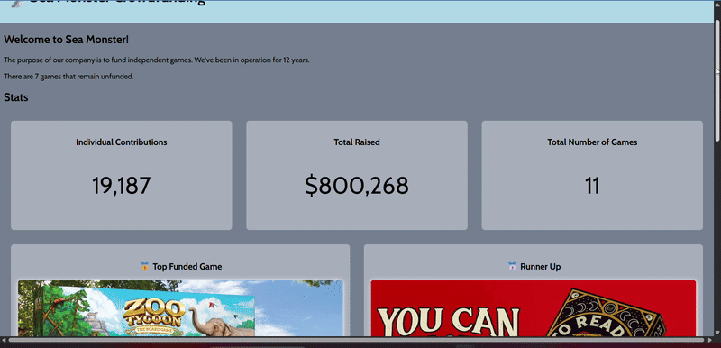

# WEB102 Prework - Web102 Prework App

Submitted by: **Raymond Quan**

**Web102 Prework App** is a website for the company Sea Monster Crowdfunding that displays information about the games they have funded, including statistics, filters for funded/unfunded games, and top performers.

Time spent: 7 hours spent in total

## Required Features

The following **required** functionality is completed:

- [x] The introduction section explains the background of the company and how many games remain unfunded.
- [x] The Stats section includes information about the total contributions and dollars raised as well as the top two most funded games.
- [x] The Our Games section initially displays all games funded by Sea Monster Crowdfunding
- [x] The Our Games section has three buttons that allow the user to display only unfunded games, only funded games, or all games.

## Optional Features

- [ ] (Optional) Added animations or other enhancements

## Video Walkthrough

Here's a walkthrough of implemented features:

GIF created with **ScreenToGif**

## Notes

While building the Sea Monster Crowdfunding application, I improved my skills with:

- Parsing and working with JSON data
- DOM manipulation and dynamic element creation
- CSS Flexbox for responsive design
- JavaScript array methods
- Handling events and state with buttons

-Maintaining clean and organized code while implementing multiple features was a key challenge that ultimately strengthened my problem-solving ability.

## License

Copyright 2024 Raymond Quan

Licensed under the Apache License, Version 2.0 (the "License");
you may not use this file except in compliance with the License.
You may obtain a copy of the License at

arduino
Copy
Edit
http://www.apache.org/licenses/LICENSE-2.0
